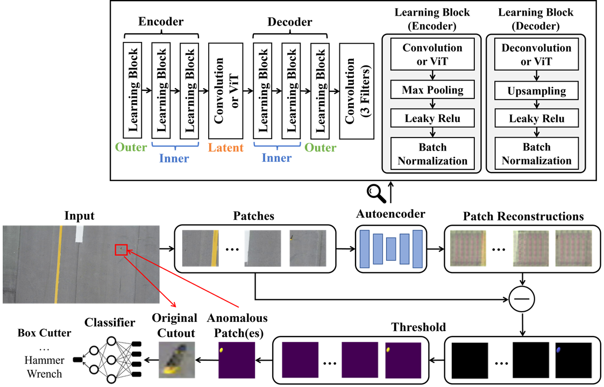

# Overview
This data was created to support the FOD detection methodology presented in the paper cited below. The data is provided as an additional contribution of our paper, and it can be downloaded at the link below. If the data and/or paper is helpful to your work, please consider citing the paper.

## Runway Image Dataset

The dataset includes training and testing datasets designed for FOD detection using self-supervised methods. The training dataset contains pictures of runways in normal conditions. That is, the training dataset does not include FOD objects. Since the training dataset is designed for self-supervised detection methods, the training data does not require annotation other than the image itself. The testing dataset includes images of runway pavement that contain FOD. The location of FOD in the testing dataset are annotated using bounding box labels to facilitate perfomance validation. The top row of the figure below are examples of training images, and the bottom row contains examples of testing images with annotation.

  

The training dataset contains 81,185 images, and the testing dataset contains 447 testing images with corresponding annotation. All images were collected from the perspective of unmanned aircraft systems (aka "drones") at a local airport. For more information on the data collection framework used to create this dataset, reference section III-A of the cited paper.

## Paper Citation
Travis Munyer, Daniel Brinkman, Xin Zhong, Chenyu Huang, Iason Konstantzos. 2022. Foreign Object Debris Detection for Airport Pavement Images based on Self-Supervised Localization and Vision Transformer. 2022 International Conference on Computational Science & Computational Intelligence (CSCI'22). https://arxiv.org/abs/2210.16901 

This figure is an overview of the detection methodology presented in the paper.

  

## Download Data
The data is no longer available. Feel free to use normal images of common concrete to reproduce the paper. To improve performance, include several shades of concrete and painted lines similar to those seen in airports.
