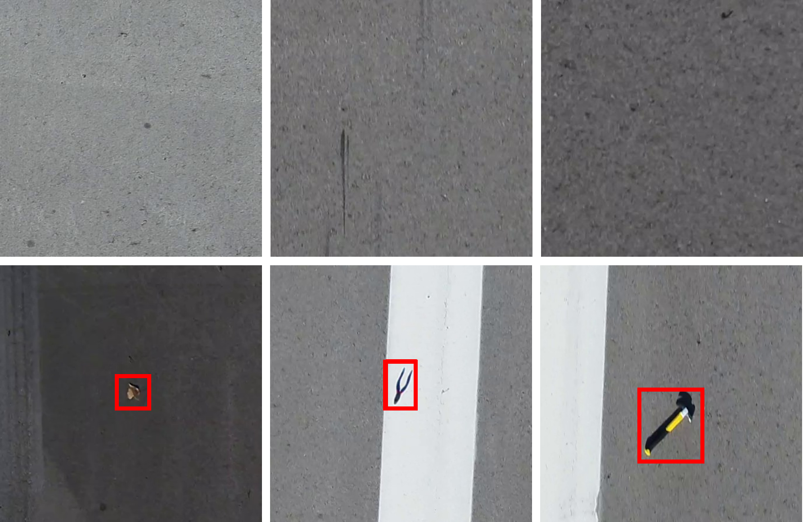

# Overview
This data was created to support the FOD detection methodology presented in the paper cited below. The data is provided as an additional contribution of our paper, and it can be downloaded at the link below. If the data and/or paper is helpful to your work, please consider citing the paper. 

  

## Runway Image Dataset

The dataset includes training and testing datasets for FOD detection used self-supervised techniques. The training dataset contains pictures of runways in normal conditions. That is, the training dataset does not include FOD objects. Since the training dataset is designed for self-supervised detection methods, the training data does not require annotation. The testing dataset includes images of runway pavement that contain FOD. The location of FOD in the testing dataset are annotated using 
bounding box labels so that the performance of detection methods can be validated by comparing results to these annotations.

  

The training dataset contains 81,185 images, and the testing dataset contains 447 testing images with corresponding annotation. For more information on the data collection framework used to create this dataset, reference section III-A of the cited paper.

## Paper Citation
Travis Munyer, Daniel Brinkman, Xin Zhong, Chenyu Huang, Iason Konstantzos. 2022. Foreign Object Debris Detection for Airport Pavement Images based on Self-Supervised Localization and Vision Transformer. 2022 International Conference on Computational Science & Computational Intelligence (CSCI'22). https://arxiv.org/abs/2210.16901 

## Download Data
[FOD Anomaly Data Download](https://docs.google.com/uc?export=download&id=1ayz5qo46pxoLpxx1h3EnnucI8EOflZTz)
